# Development Log

The development log captures key moments in your application development:

- **Design ideas / notes** for features, UI, etc.
- **Key features** completed and working
- **Interesting bugs** and how you overcame them
- **Significant changes** to your design
- Etc.

---

## 21/04/2025
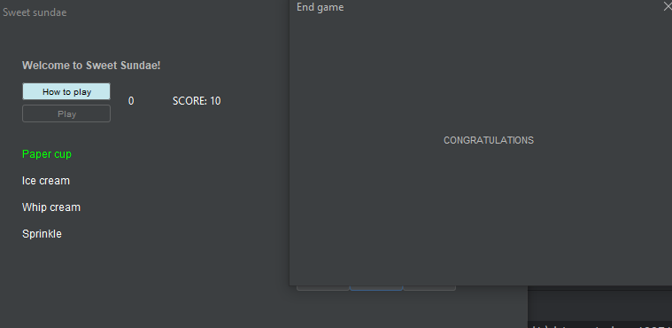

A pop-up window has been added to the game. Once the timer hits 0 (i.e. time stops running), a window pop-up to show that the game has ended.
For this pop up, I need to:
- Position the "congratulations" text
- Have a label showing the player's finishing score
- Play again button
- Once exit, the game reset.

## 28/04/2025
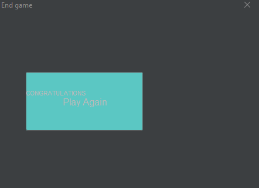

I have just instantiated the play again button on the finishing window. There is a problem for it to function.

---

---

## Date: 04/04/2025

Example description and notes. Example description and notes. Example description and notes. Example description and notes. Example description and notes. Example description and notes.

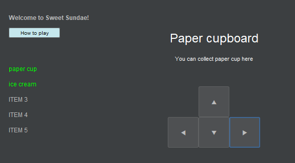
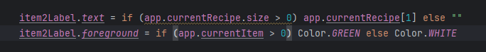

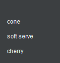

- I think it will appear better and make more sense if the first alphabetical letter is in uppercase.
---
## 01/05/2025

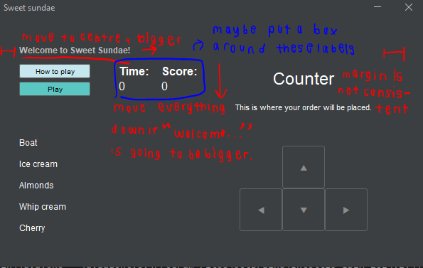

This is what I think should be fixed or re-adjusted for the UI.

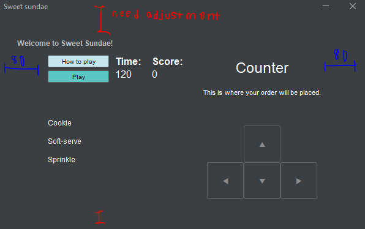

Left-right margin is now fixed. However, the top and bottom margin are still not equal.

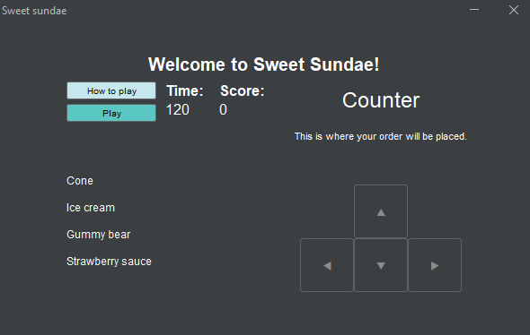

Heading has now been readjusted. It is put at the centre of the window with an increase in font-size.

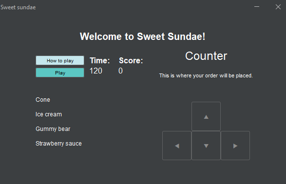

It has been re-adjusted a little bit more. It still looks packed and not in place because I have just only moved the how to play button and play button.

Looking better once the current location and description labels have been moved.

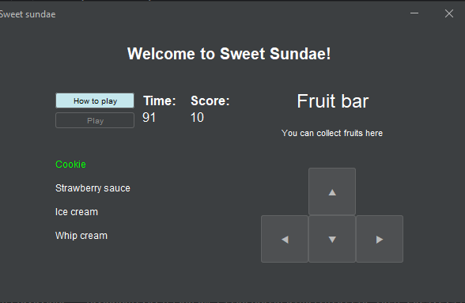

The interface if the game now looks reasonably better. Maybe I should add boxes around some components.

## 02/05/2025

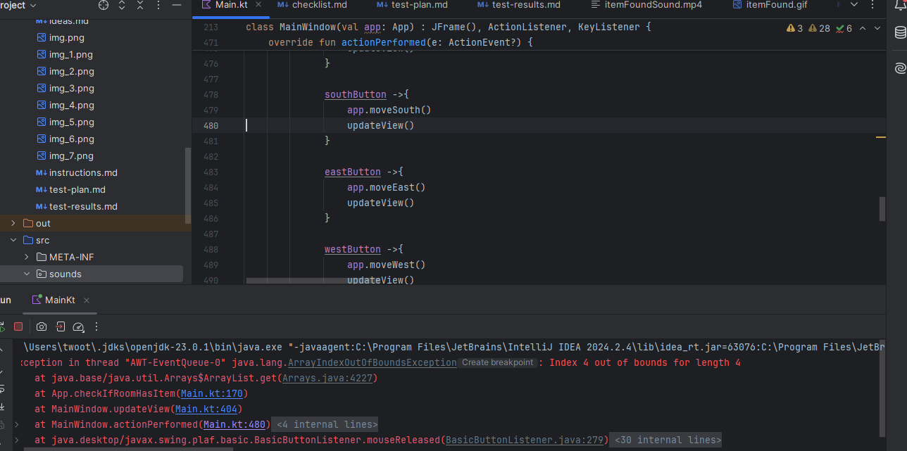

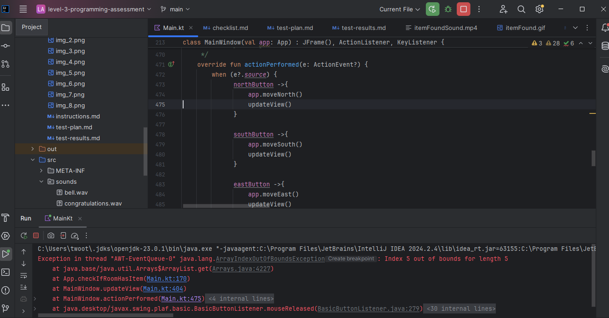

