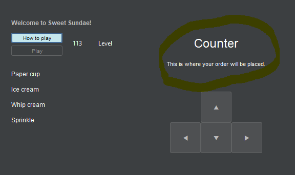
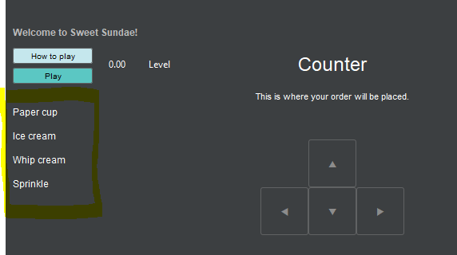
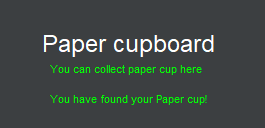
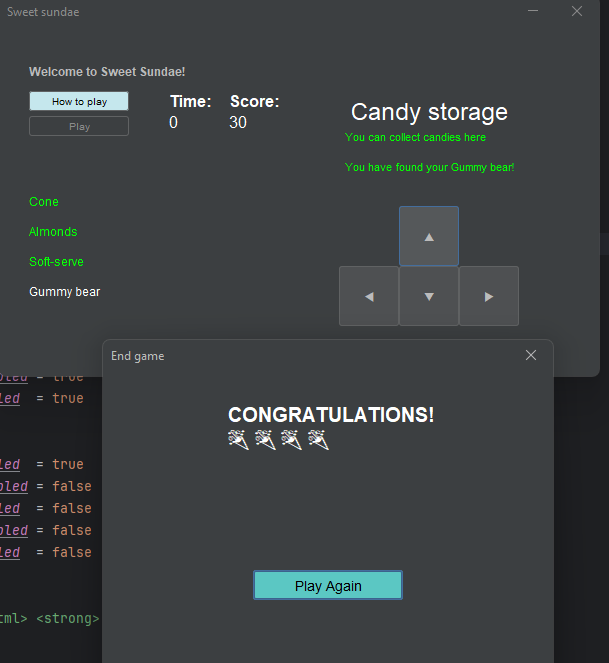

# Results of Testing

The test results show the actual outcome of the testing, following the [Test Plan](test-plan.md)

---
## Map
The following image is the map that I have created for the Sweet sundae game, and will be used as part of the test data for most of the testings.

## Starter
The player start from the counter (starter point of the game).

### Test Data Used
The map

### Test Result

The player is placed at the counter, which is the starter pint of the game when the play button is clicked.

---

## Movement check
The payer should be able to move to different locations on the map in the following direction: North, East, South and West.

### Test Data Used
The map and the display text of the player's current location.

### Test Result
- Move north

When the north button is clicked, the player moves into the fridge, which is to the north of the counter.
- Move east

When the east button is clicked, the player moves into the paper cupboard, which is to the east of the counter.
- Move south

When the south button is clicked, the player moves from the paper cupboard to cone room, which is to the south of the paper cupboard.
- Move west

When the west button is clicked, the player moves from the sauce fountain to the paper cupboard, which is to the west of the sauce fountain.

---

## Recipe check

### Showing recipe
The recipe must be shown on the left hand-side of the game window.

### Test data used
A list of items in a recipe

### Test Result

The part highlighted in yellow shows that the list of items in the recipe is visible on the left.

### Feedback
There should be a name of that recipe shown above the first item.

### Recipe's randomisation
The player will be given a random recipe after completing each recipe.

### Test data used
Tried completing the recipe

### Test Result

Once the player has complated the first recipe, the game randomises another recipe for the player. The list of items need in the 2 recipes are different.

### Items in the recipe found
The player has found the item shown in the recipe.

### Test data used
Name of the items in the recipe and name of the items in different location on the map.

### Test Result

The name of that item in the recipe turns green after it has been found. I have also set the description of the room to green as well when the item has been found

### Problem
As seen in the GIF, the description text needs to be adjusted.

### Fix

The description text and the message telling the player that they have found the item is now broken into 2 lines, using the HTML.

### Order of items in the list
The player must look for the item in order, i.e. they have to find the fist item before moving on to the next one.

### Test data used
Items on the list and try looking for the second item on the recipe (have not found the first one yet).

### Test Result

In this trial, I tried looking for the soft-serve, which is the second item on the list. I found my way to the soft serve machine where the soft serve can be found. However, the text of soft-serve on the recipe does not turn green and remains as white. This tells the player that they must collect the first item on the list. The GIF below shows when I have already found the fist item, and how the game allows me to look for the next one.

## How to play button
This is where the player can see the instruction for this game.

## Test data used
How to played button being clicked and the pop up window with instruction text

## Test result

A smaller window appears when the how to play button was clicked. The window contains an instruction on how to play and the player must click the cross to exit this window.

## Feedback
I got a feedback that I should add a bit of a story to the instruction to make the aim of the game clearer and draw the player's attention to the game.

## Fix

## Play button and countdown time
The game starts when the player hits the play button.

## Test data used
Clicking the play button and the display of the movement buttons. Timer with a time limit set as 120 seconds.

## Test Result

The GIF shows that before the play button was clicked, the movement buttons were disabled. Once the button was clicked, the movement buttons were enabled while the play button became disabled. This is to prevent the player from multiple clicking.
Time decreases by 1 second consistently.

## Feedback
The timer label is too small and instead of it being shown as 0.00, it should be set as 120 s.

## Fix

## Time limit
The player will face lesser and lesser time limit after completing each recipe.

## Test data used
Time limit being set originally as 120 seconds and then decreases by 0.8 of 120 seconds

## Test Result

When the player has completed the recipe, we can see that the time has gone up again, but only 96 seconds, which is 0.8 of 120 seconds. Eventually, the time limit will continue to reduce without reaching 0.

## Add score
Scores are rewarded to the player after they have found items or completed the recipe.

## Test data used
Initial score was set to 0. Set the 10 scores added when the player have found the item and 100 scores once the recipe is completed.

## Test Result

When the paper was found, 10 scores were added to the score label.

When the recipe was completed, 100 scores were added to the score label.

## Game finish
The player is notified once the game is done (time hit 0)

## Test data used
Time hitting 0 , time limit as 12 seconds (so we see the results quicker) and the pop-up window congratulating the player

## Test Result
This is the result from the first test.

- The window congratulating the player pops up as the time hit 0 second.
- The window is not visible again when the cross at the corner of the window is hit.
However, the game does not reset, and I had to click a direction button before it resets (the time is 0 and the play button is disabled, which is not the beginning state of the game). My expected result is that when the player hits the cross, the game should already go back to the start.

This is the result from the second test.

When the congratulations window disappear, I could see that the game has reset. The play button is enabled, the movement buttons are disabled, the player has been moved back to the counter (starting position), and the score is at 0. The time label still needs to be fixed, it should be labeled as 12 in this case as I have input 12 seconds as the original time limit for faster testing trials.

